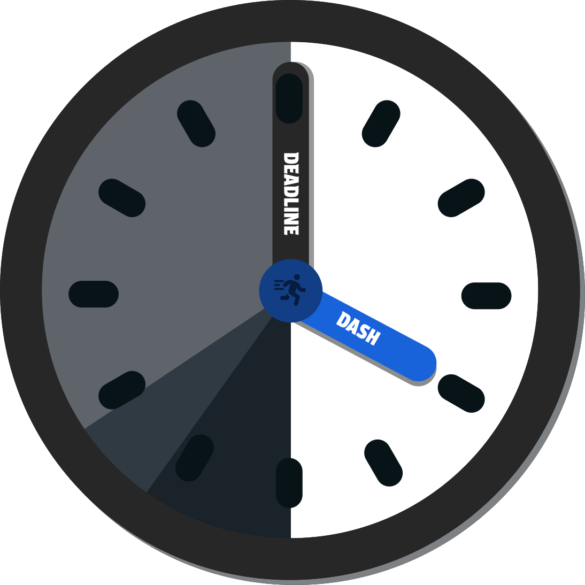
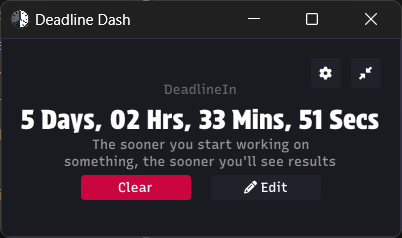
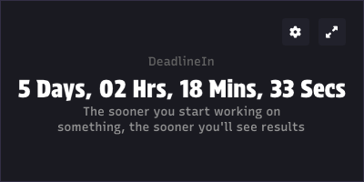
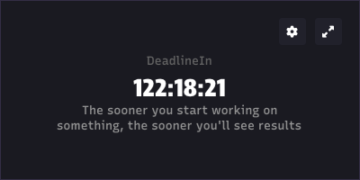
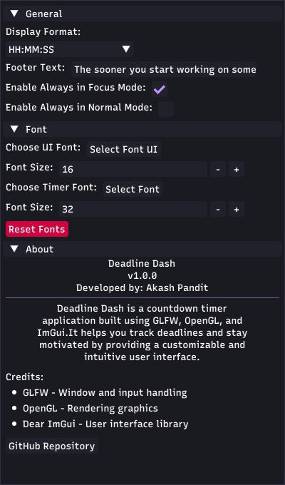
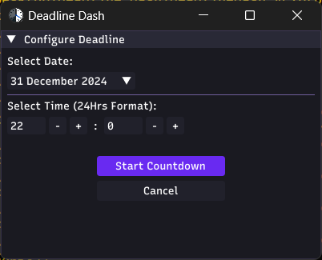

# Deadline Dash
<p align="center">
  
</p>

<h1 align="center">
  Deadline Dash
</h1>
Deadline Dash is a sleek and customizable countdown timer application built with GLFW, OpenGL, and ImGui. It helps you track deadlines effectively by displaying a countdown in an intuitive and user-friendly interface. Whether you need to focus or keep track of your goals, Deadline Dash is here to make sure you never miss a deadline!

## Features

- **Dynamic Countdown Timer:** Displays the remaining time in days, hours, minutes, and seconds.
- **Customizable Display Format:** Choose how the timer format appears (e.g., "Days, Hrs, Mins, Secs").
- **Focus and Normal Modes:**
  - Focus mode ensures the timer stays visible above other windows.
  - Normal mode integrates seamlessly with your desktop.
- **Font Customization:**
  - Select different fonts for the UI and the timer.
  - Adjust font sizes for better readability.
- **Footer Text:** Personalize motivational messages beneath the timer.
- **Reset Fonts:** Restore font settings to default with a single click.
- **Deadline Configuration:**
  - Choose a specific date and time for your deadline.
  - Easily start, reset, or edit your countdown.

## Screenshots

### Main Timer View

### Focus Mode



### Settings Panel


### Configure Deadline


## How to Run

1. Clone the repository:
    ```bash
    git clone https://github.com/akash1474/deadline_dash.git
    ```
2. Navigate to the project directory:
    ```bash
    cd deadline-dash
    ```
3. Build the project using Premake (or your preferred build system):
    ```bash
    build
    ```
4. Run the application:
    ```bash
    build run
    ```

## Requirements

- GLFW
- OpenGL
- ImGui
- Premake: Build system used

Make sure the required dependencies are installed before building the project.

## How to Use

1. Launch the app.
2. Set your deadline via the "Configure Deadline" panel.
3. Customize display and fonts in the "Settings" panel.
4. Watch the countdown tick and stay motivated!

## License

This project is licensed under the [MIT License](LICENSE).

## Contributing

Contributions are welcome! Feel free to open issues or submit pull requests to improve Deadline Dash.

